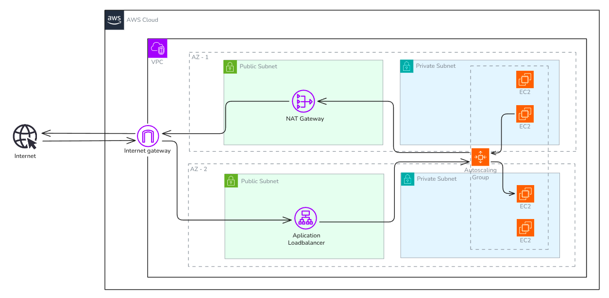

# 🚀 Terraform AWS Flask App (High Availability Infra)

Este projeto demonstra como provisionar uma aplicação Flask com Redis e Docker na AWS, utilizando **Terraform** com boas práticas de modularização, pipelines GitHub Actions e **infraestrutura altamente disponível** com Auto Scaling e Application Load Balancer.

---

## 📌 Visão Geral



O objetivo deste projeto é provisionar e manter uma aplicação Flask em um ambiente altamente disponível e escalável, utilizando as melhores práticas de IaC (Infraestrutura como Código) com Terraform.

A infraestrutura é composta por:

- VPC com subnets públicas e privadas (multi-AZ)
- Application Load Balancer (ALB)
- Auto Scaling Group com instâncias EC2
- AMIs construídas dinamicamente com Packer
- Redis containerizado junto à aplicação Flask (via Docker)
- Pipeline CI/CD com GitHub Actions
- Remote backend S3 para gerenciamento de estado do Terraform

---

## 🛠️ Tecnologias Utilizadas

- **Terraform** (modular e reutilizável)
- **AWS** (EC2, ALB, ASG, VPC, S3, NAT Gateway)
- **GitHub Actions** (CI/CD e automação de pipelines)
- **Docker / Docker Compose**
- **Packer** (criação de AMI com ambiente pré-configurado)
- **Flask + Redis** (aplicação web simples com backend Redis)

---

## 🧱 Estrutura do Projeto

```bash
├── app                      # Código da aplicação Flask + Redis
│   ├── Dockerfile
│   ├── docker-compose.yml
│   ├── main.py
│   └── requirements.txt
│
├── infra                    # Infraestrutura em Terraform
│   ├── environments
│   │   ├── staging/
│   │   └── prod/
│   ├── backend.tf
│   ├── main.tf
│   ├── outputs.tf
│   └── variables.tf
│
├── packer                   # Configuração da AMI
│   └── aws-ubuntu.pkr.hcl
│
├── .github/workflows        # Pipelines GitHub Actions
│   ├── deploy.yml
│   └── remote-backend.yml
│
└── README.md
```
## 🧬 Fluxo DevOps

## 1. 🔒 Backend Remoto  
Ao iniciar o projeto, uma pipeline `remote-backend.yml` é executada para provisionar um bucket S3 remoto, usado como backend seguro para os estados do Terraform. Confira o projeto [`remote-backend.yml`](https://github.com/vinicius3516/terraform-bootstrap).

## 2. 🏗️ Criação da AMI (via GitHub Actions)  
Usa o **Packer** para construir uma AMI customizada contendo Docker, Redis, dependências Python e a aplicação Flask.

A AMI é nomeada com timestamp e armazenada para reutilização.

## 3. ☁️ Provisionamento da Infra (Terraform)  
Pipelines `deploy.yml` são responsáveis por criar ou destruir toda a infraestrutura.

A modularização separa responsabilidades como:
- `vpc`
- `sg`
- `alb`
- `asg`

## 4. 🌐 Deploy e Alta Disponibilidade  
- O **ALB** redireciona tráfego para instâncias em múltiplas **AZs**.  
- O **ASG** gerencia a escala automática das instâncias EC2.  
- **Subnets privadas** garantem maior segurança para os workloads.

## 🔄 Pipelines GitHub Actions

- `remote-backend.yml`: Cria o backend remoto no S3.

- `deploy.yml`: Executa o build da AMI com Packer e aplica a infraestrutura com Terraform.

**Deploys** são disparados ao fazer push nas branches `main` (prod) ou `staging`.

## 🌐 Acesso à Aplicação
> Após o provisionamento, a URL pública da aplicação estará disponível como output do Terraform (via DNS do ALB).